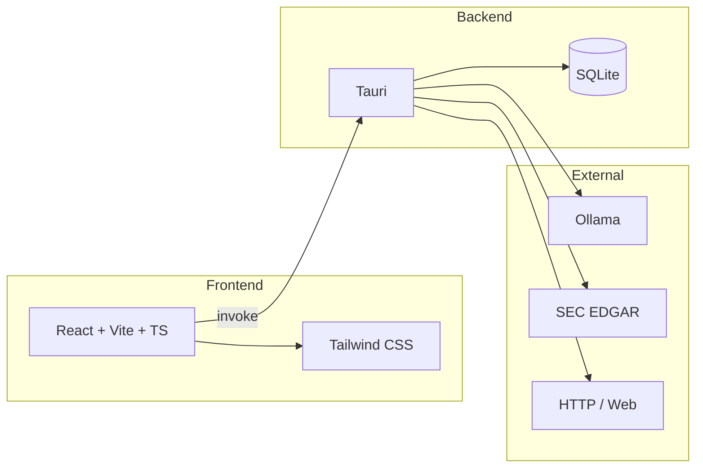

# Marketing Intelligence Engine — System Design

This document describes the **system design and built intent** of the Marketing Intelligence Engine: what the system is, what it is meant to do, and how its parts fit together. It is a system description, not end-user documentation.

---

## 1. Purpose and design intent

The **Marketing Intelligence Engine** is a **local-first desktop application** for marketing research and intelligence. Its built intent is:

- **Local-first**: All primary data (ads, verified emails, pattern stats) and processing live on the user’s machine. No required cloud services; optional use of a local LLM (Ollama) for chat and strategy.
- **Privacy and cost**: No upload of ads or email lists to third parties. LLM inference runs locally via Ollama when used, avoiding per-token cloud costs.
- **Unified workspace**: One app that combines ad discovery, pattern analysis, email verification, optional SEC data, and an AI assistant that can reason over this data when the user asks.
- **Extensibility**: User-definable agent modes (personas) and export of Modelfiles so personas can be run as dedicated Ollama models.

The system is **not** a generic CRM or campaign manager. It is focused on **research and intelligence**: ingesting and structuring ad copy, verifying email lists, and providing a single place to query and reason over that data with an AI assistant.

---

## 2. High-level architecture

- **Frontend**: React 19, Vite, TypeScript. Tailwind CSS and shared UI primitives (Base UI / shadcn-style). Single-page app with a sidebar for modules and a floating chat overlay.
- **Backend**: Tauri 2 (Rust). Commands exposed via `invoke('command_name', payload)`. No REST API; all backend access is through Tauri IPC.
- **Storage**: SQLite database (`engine.db`) in the Tauri app data directory. Tables: `ads`, `verified_emails`. Frontend uses `localStorage` for UI state (chat sessions, custom agent modes, AI timeouts, overlay position).
- **Optional external**: Ollama (localhost) for chat and strategy; SEC EDGAR (public API) for company tickers and filings; HTTP for ad scraping and optional URL fetch in chat.

---

## 3. Data model (backend)

- **ads**  
  `id`, `content`, `hook`, `emotion`, `offer`, `audience`, `source`, `created_at`.  
  Filled by scraping and/or pattern analysis. `source` typically holds the search keyword; filters and pattern stats are derived from this table.

- **verified_emails**  
  `email` (PK), `status`, `quality`, `verified_at`, plus test result columns: `syntax_ok`, `mx_ok`, `disposable_ok` (0/1/NULL).  
  Populated by single and bulk verification; status/quality drive filtering and cross-reference in Email Intelligence.

SEC data is not persisted in SQLite; it is fetched on demand (company tickers, submission/filings by CIK) and passed into the chat context or strategy agent when needed.

---

## 4. Modules and capabilities

The app exposes three main modules in the sidebar plus a global chat overlay. Each maps to a slice of backend commands and data.

### 4.1 Ad Explorer

**Intent**: Ingest ad copy by keyword, structure it (hooks, emotions, offers, audience), and support filtering, aggregation, and export.

- **Scraping**: User enters a keyword; backend fetches HTML (reqwest + scraper), parses ad-like snippets (e.g. from `p`, headings, class names containing "ad"/"copy"), or uses built-in demo snippets with pre-filled hook/emotion/offer for development. Ads are stored in `ads` with `source` = keyword. Modes: replace (clear that source first) or append; limit (e.g. 1–500) caps insert count.
- **Pattern analysis**: Backend runs regex/keyword-based extraction (hooks, emotions, offers, audience) over `content` and updates `ads` columns. Frontend triggers “Analyze patterns” and refreshes list and stats.
- **Pattern stats**: Aggregations (e.g. top hooks, emotions, offers) from DB; displayed as tables and ECharts. Filters by hook, emotion, offer, source drive the list and charts.
- **UI**: Table/card list of ads, source/hook/emotion/offer filters, tabs (overview, by-source, all-ads), detail sheet per ad, CSV export via Tauri save dialog and `write_export_file`. Batch keywords (multiple scrape runs) are supported from the UI.

### 4.2 Email Intelligence

**Intent**: Verify email addresses (syntax, MX, disposable) and manage results in a single place, with optional cross-reference and export.

- **Verification**: Backend checks syntax (regex), MX (trust-dns-resolver), and a static disposable-domain list; returns status (ok, invalid, disposable, catch_all, unknown) and quality (good, bad, risky). Single verify or bulk (file path); results can be stored in `verified_emails`.
- **UI**: Single-email input and result; bulk file picker and progress; virtualized table of stored emails with status/quality and test indicators. Filters (search, status, quality). Cross-reference: user uploads a “reference” CSV and a “contact” CSV, selects email column and optional filters; app computes overlap and allows export of the result via save dialog.

### 4.3 Settings

**Intent**: Configure AI timeouts and define custom chat personas that can be exported as Ollama Modelfiles.

- **AI timeouts**: Copywriting, chat, and strategy request timeouts (seconds) stored in `localStorage`; used by the frontend when calling Ollama-related commands.
- **Custom agent modes**: User adds modes with a label and system prompt; stored in `localStorage` under `custom-agent-modes`. Each mode appears in the chat persona selector. “Create Modelfile” opens a save dialog; backend command `write_modelfile(path, name, system_prompt)` writes an Ollama Modelfile (FROM qwen2.5, SYSTEM, PARAMETERs) so the user can run `ollama create ...` locally.

### 4.4 Chat overlay (FAB)

**Intent**: Provide a single AI assistant that can use the engine’s data (ads, pattern stats, verified emails, SEC) when the user asks, with selectable personas and optional streaming.

- **Sessions**: Chat sessions (id, title, messages) stored in `localStorage`. User can create, rename, delete, and switch chats; layout (side panel or bottom bar) is persisted.
- **Personas**: Built-in modes (e.g. create_copy, strategy, funnel, competitor, general) plus custom modes from Settings. Each mode has a system prompt and an optional recommended Ollama model name. Frontend merges built-in and custom modes and shows a selector with icons.
- **Context injection**: Before sending the user message, the frontend (or backend) requests a context string: recent ads (content/hook/offer), pattern stats (top hooks/emotions/offers), verified-email counts, and optionally SEC company/filing summary. This is appended to the prompt so the model can answer using “your data” when relevant.
- **Ollama**: List models, send chat (with optional stream), prewarm model. Timeouts come from Settings. If the selected persona has a recommended model and it appears in the list, it can be auto-selected.
- **Protocols**: System prompts instruct the model to use `[CLARIFY: option1 | option2 | option3]` for choices and `[FETCH: https://url]` for external URLs; the frontend parses these and shows UI (e.g. Allow/Deny fetch) and can call `fetch_url` (backend, HTTPS only) then re-send with fetched content.

---

## 5. Backend services (Rust)

| Layer | Role |
|-------|------|
| **db** | SQLite init/migrations, ads CRUD, pattern stats queries, verified_emails CRUD. |
| **scrape** | HTTP fetch, HTML parse, ad-snippet extraction; demo snippet set with pre-filled hook/emotion/offer. |
| **analysis** | Pattern extraction (hook, emotion, offer, audience) via keyword lists; updates ad rows. |
| **email_verify** | Syntax check, MX lookup (async), disposable-domain check; returns status and quality. |
| **sec** | SEC EDGAR: company tickers JSON, submissions by CIK, filing list (form, date, accession). |
| **strategy_agent** | “Tools”: query ads, pattern stats, verified-email summary; `build_chat_context`; optional LLM run to produce a strategy report (markdown). |
| **ollama** | List models, chat (blocking and stream), prewarm; `build_chat_prompt` (system + context + user + clarify instruction). |

Tauri commands wire these into the frontend: e.g. `scrape_ads`, `clear_ads`, `list_ads_cmd`, `analyze_patterns`, `get_pattern_stats_cmd`, `verify_email_cmd`, `verify_email_and_store`, `verify_bulk`, `get_verified_emails`, `write_export_file`, `write_modelfile`, `fetch_url`, `run_strategy_agent_cmd`, `generate_copy_variants`, `ollama_list_models`, `ollama_chat`, `ollama_chat_stream`, `ollama_prewarm`, `sec_fetch_company_tickers`, `sec_company_filings`.

---

## 6. Data flow (simplified)

1. **Ad pipeline**: User keyword → `scrape_ads` → fetch/parse or demo data → `insert_ads` → DB. User clicks “Analyze patterns” → `analyze_patterns` → `update_ad_patterns` → DB. UI reads via `list_ads_cmd`, `get_pattern_stats_cmd`.
2. **Email pipeline**: User email or file → `verify_email_*` / `verify_bulk` → `upsert_verified_email` → DB. UI reads via `get_verified_emails`. Export: build CSV in frontend, save dialog, `write_export_file`.
3. **Chat**: User selects model and persona; frontend gets `getSystemPromptForMode(id)` and (for context) backend builds context from DB (and optionally SEC). Frontend calls `ollama_chat_stream` (or `ollama_chat`) with prompt built from system prompt + context + user message. Streamed tokens are rendered in the overlay; [CLARIFY] and [FETCH] are parsed and handled in the UI.
4. **Modelfile export**: Settings → user defines mode (label + prompt) → “Create Modelfile” → save dialog → `write_modelfile(path, name, system_prompt)` → file on disk for `ollama create`.

---

## 7. Agent modes (personas)

Personas define how the assistant behaves and what it emphasizes:

- **Built-in**: Create copy, Strategy, Funnel analysis, Competitor analysis, General. Each has a fixed system prompt and a recommended model name (e.g. `ads-engine-copy`). Shipped Modelfiles in `resources/modelfiles/` match these for users who run Ollama.
- **Custom**: Stored in `localStorage`; label, system prompt, and generated id/recommendedModelName. User can export a Modelfile from Settings so the same persona can be used as a dedicated Ollama model.

The chat overlay uses a single “market expert” entry point; the chosen mode only changes the system prompt (and optionally the suggested model). Strategy/funnel/competitor/copy are **intents** implemented via prompts and optional dedicated models, not separate app modules.

---

## 8. Technology stack (reference)

| Concern | Choice |
|--------|--------|
| Desktop shell | Tauri 2 |
| Frontend | React 19, Vite, TypeScript |
| Styling | Tailwind CSS 4, tw-animate-css |
| UI components | Base UI React, shadcn-style (button, card, dialog, input, select, sheet, skeleton, table, tabs) |
| Charts | ECharts (echarts-for-react) |
| Backend | Rust (rusqlite, reqwest, scraper, trust-dns-resolver, serde) |
| DB | SQLite (engine.db in app data dir) |
| LLM | Ollama (localhost), optional |
| Plugins | tauri-plugin-dialog, tauri-plugin-opener |

---

## 9. Prerequisites and build (concise)

- **Node.js** (v18+), **Rust** (stable, 1.76+), **npm** (or yarn).
- **Develop**: `npm install` then `npm run tauri dev`.
- **Release**: `npm run tauri build`; installers under `src-tauri/target/release/bundle/`.
- **Rust tests**: `cd src-tauri && cargo test`.

---

## 10. Summary

The Marketing Intelligence Engine is a **local-first desktop system** for marketing research: **ingest and structure ad copy**, **verify and manage email lists**, and **query and reason over that data** with an optional local LLM. Its design emphasizes **privacy**, **no required cloud**, and **extensibility** (custom personas, Modelfile export). The architecture is a Tauri backend (Rust, SQLite, scraping, email verification, SEC, Ollama) plus a React frontend with three main modules (Ad Explorer, Email Intelligence, Settings) and a global chat overlay that unifies data and personas into one assistant experience.
