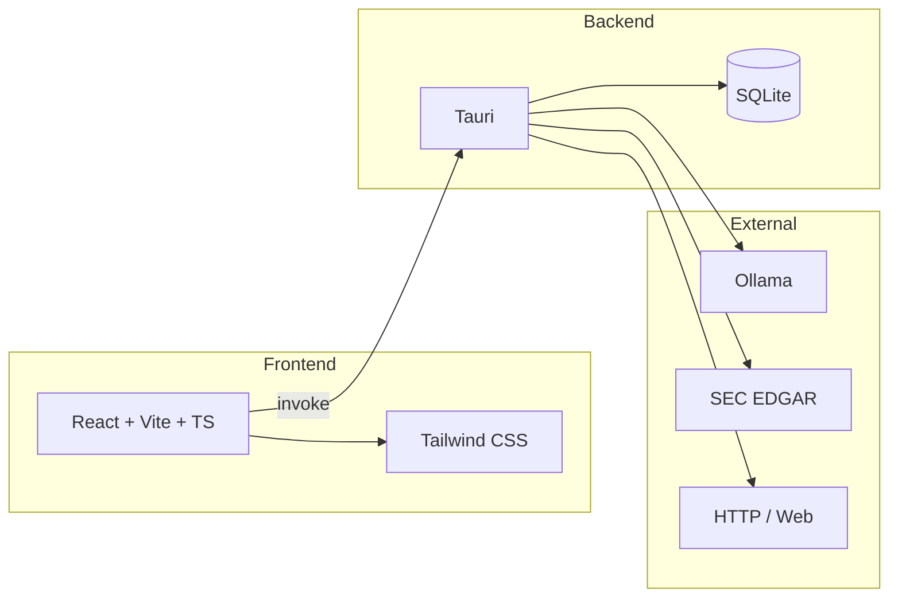

# Marketing Intelligence Engine — System Design

This document describes the **system design and built intent** of the Marketing Intelligence Engine: what the system is, what it is meant to do, and how its parts fit together. It is a system description, not end-user documentation.

---

## 1. Purpose and design intent

The **Marketing Intelligence Engine** is a **local-first desktop application** for marketing research and intelligence. Its built intent is:

- **Local-first with optional cloud**: All primary data (ads, verified emails, pattern stats) and processing live on the user’s machine. Chat can use a **local LLM (Ollama)** or a **cloud API** (any OpenAI-compatible endpoint or built-in Gemini/OpenRouter/Groq). No required cloud; you choose.
- **Privacy and cost**: No upload of ads or email lists to third parties unless you opt into cloud chat. Local inference via Ollama avoids per-token cost; cloud is optional and uses your API keys.
- **Unified workspace**: One app that combines ad discovery, pattern analysis, email verification, optional SEC data, and an AI assistant that can reason over this data when the user asks.
- **Extensibility**: Add and name **custom agents** (label + system prompt); they appear in the chat persona selector. Export Modelfiles from Settings so personas can be run as dedicated Ollama models.

The system is **not** a generic CRM or campaign manager. It is focused on **research and intelligence**: ingesting and structuring ad copy, verifying email lists, and providing a single place to query and reason over that data with an AI assistant.

---

## 2. High-level architecture

- **Frontend**: React 19, Vite, TypeScript. Tailwind CSS and shared UI primitives (Base UI / shadcn-style). Single-page app with a sidebar for modules and a floating chat overlay.
- **Backend**: Tauri 2 (Rust). Commands exposed via `invoke('command_name', payload)`. No REST API; all backend access is through Tauri IPC.
- **Storage**: SQLite database (`engine.db`) in the Tauri app data directory. Tables: `ads`, `verified_emails`. Frontend uses `localStorage` for UI state (chat sessions, custom agent modes, AI timeouts, overlay position).
- **Optional external**: Ollama (localhost) for local chat and strategy; optional **cloud LLM** (any OpenAI-compatible API or Gemini/OpenRouter/Groq) when enabled in Settings; SEC EDGAR (public API) for company tickers and filings; HTTP for ad scraping and optional URL fetch in chat.

---

## 3. Data model (backend)

- **ads**  
  `id`, `content`, `hook`, `emotion`, `offer`, `audience`, `source`, `created_at`.  
  Filled by scraping and/or pattern analysis. `source` typically holds the search keyword; filters and pattern stats are derived from this table.

- **verified_emails**  
  `email` (PK), `status`, `quality`, `verified_at`, plus test result columns: `syntax_ok`, `mx_ok`, `disposable_ok` (0/1/NULL).  
  Populated by single and bulk verification; status/quality drive filtering and cross-reference in Email Intelligence.

SEC data is not persisted in SQLite; it is fetched on demand (company tickers, submission/filings by CIK) and passed into the chat context or strategy agent when needed.

---

## 4. Modules and capabilities

The app exposes three main modules in the sidebar plus a global chat overlay. Each maps to a slice of backend commands and data.

### 4.1 Ad Explorer

**Intent**: Ingest ad copy by keyword, structure it (hooks, emotions, offers, audience), and support filtering, aggregation, and export.

- **Scraping**: User enters a keyword; backend fetches HTML (reqwest + scraper), parses ad-like snippets (e.g. from `p`, headings, class names containing "ad"/"copy"), or uses built-in demo snippets with pre-filled hook/emotion/offer for development. Ads are stored in `ads` with `source` = keyword. Modes: replace (clear that source first) or append; limit (e.g. 1–500) caps insert count.
- **Pattern analysis**: Backend runs regex/keyword-based extraction (hooks, emotions, offers, audience) over `content` and updates `ads` columns. Frontend triggers “Analyze patterns” and refreshes list and stats.
- **Pattern stats**: Aggregations (e.g. top hooks, emotions, offers) from DB; displayed as tables and ECharts. Filters by hook, emotion, offer, source drive the list and charts.
- **UI**: Table/card list of ads, source/hook/emotion/offer filters, tabs (overview, by-source, all-ads), detail sheet per ad, CSV export via Tauri save dialog and `write_export_file`. Batch keywords (multiple scrape runs) are supported from the UI.

### 4.2 Email Intelligence

**Intent**: Verify email addresses (syntax, MX, disposable) and manage results in a single place, with optional cross-reference and export.

- **Verification**: Backend checks syntax (regex), MX (trust-dns-resolver), and a static disposable-domain list; returns status (ok, invalid, disposable, catch_all, unknown) and quality (good, bad, risky). Single verify or bulk (file path); results can be stored in `verified_emails`.
- **UI**: Single-email input and result; bulk file picker and progress; virtualized table of stored emails with status/quality and test indicators. Filters (search, status, quality). Cross-reference: user uploads a “reference” CSV and a “contact” CSV, selects email column and optional filters; app computes overlap and allows export of the result via save dialog.

### 4.3 Settings

**Intent**: Configure AI timeouts, choose chat backend (Local vs Cloud), and add custom agents that can be exported as Ollama Modelfiles.

Settings are grouped in cards:

- **Scraping**: Proxy URL (optional), rate limit (requests per minute).
- **AI timeouts**: Copywriting, chat, and strategy request timeouts (seconds) stored in `localStorage`; used when calling Ollama or cloud commands.
- **Chat backend**: Choose **Local (Ollama)** or **Cloud API**.
  - **Local (Ollama)** — in development: SEC summary model (optional), inference/speed (num_ctx, num_predict), Ollama URL. Local inference is experimental.
  - **Cloud API**: Use any LLM: **API key**, **model name** (e.g. `gpt-4o`, `gemini-2.0-flash`), and optional **API base URL**. If base URL is set, the app calls that OpenAI-compatible endpoint with your model name; if left empty, a default (OpenRouter) is used. No provider dropdown — you name the model and optionally point to any compatible API.
- **Custom agents**: Add agents with a **name** and system prompt; stored in `localStorage` under `custom-agent-modes`. Each appears in the chat persona selector. “Create Modelfile” opens a save dialog; backend `write_modelfile(path, name, system_prompt)` writes an Ollama Modelfile so you can run `ollama create ...` locally.

### 4.4 Chat overlay (FAB)

**Intent**: Provide a single AI assistant that can use the engine’s data (ads, pattern stats, verified emails, SEC) when the user asks, with selectable personas and optional streaming.

- **Sessions**: Chat sessions (id, title, messages) stored in `localStorage`. User can create, rename, delete, and switch chats; layout (side panel or bottom bar) is persisted.
- **Personas**: Built-in modes (e.g. create_copy, strategy, funnel, competitor, general) plus custom modes from Settings. Each mode has a system prompt and an optional recommended Ollama model name. Frontend merges built-in and custom modes and shows a selector with icons.
- **Context injection**: Before sending the user message, the frontend (or backend) requests a context string: recent ads (content/hook/offer), pattern stats (top hooks/emotions/offers), verified-email counts, and optionally SEC company/filing summary. This is appended to the prompt so the model can answer using “your data” when relevant.
- **Backend choice**: When **Local (Ollama)** is selected: list models, send chat (with optional stream), prewarm model; timeouts and num_ctx/num_predict come from Settings. When **Cloud API** is selected: no model list; chat uses your API key, model name, and optional base URL; the FAB and overlay show “Cloud” so the choice is visible at a glance.
- **Ollama (local)**: If the selected persona has a recommended model and it appears in the list, it can be auto-selected.
- **Protocols**: System prompts instruct the model to use `[CLARIFY: option1 | option2 | option3]` for choices and `[FETCH: https://url]` for external URLs; the frontend parses these and shows UI (e.g. Allow/Deny fetch) and can call `fetch_url` (backend, HTTPS only) then re-send with fetched content.

---

## 5. Backend services (Rust)

| Layer | Role |
|-------|------|
| **db** | SQLite init/migrations, ads CRUD, pattern stats queries, verified_emails CRUD. |
| **scrape** | HTTP fetch, HTML parse, ad-snippet extraction; demo snippet set with pre-filled hook/emotion/offer. |
| **analysis** | Pattern extraction (hook, emotion, offer, audience) via keyword lists; updates ad rows. |
| **email_verify** | Syntax check, MX lookup (async), disposable-domain check; returns status and quality. |
| **sec** | SEC EDGAR: company tickers JSON, submissions by CIK, filing list (form, date, accession). |
| **strategy_agent** | “Tools”: query ads, pattern stats, verified-email summary; `build_chat_context`; optional LLM run to produce a strategy report (markdown). |
| **ollama** | List models, chat (blocking and stream), prewarm; `build_chat_prompt` (system + context + user + clarify instruction). |
| **remote_client** | Cloud chat: OpenAI-compatible (any base URL or OpenRouter/Groq) and Google Gemini. Optional `cloud_base_url` for custom endpoints; when set, `cloud_model` is the model name. |

Tauri commands wire these into the frontend: e.g. `scrape_ads`, `clear_ads`, `list_ads_cmd`, `analyze_patterns`, `get_pattern_stats_cmd`, `verify_email_cmd`, `verify_email_and_store`, `verify_bulk`, `get_verified_emails`, `write_export_file`, `write_modelfile`, `fetch_url`, `run_strategy_agent_cmd`, `generate_copy_variants`, `ollama_list_models`, `ollama_chat`, `ollama_chat_stream`, `ollama_prewarm`, `sec_fetch_company_tickers`, `sec_company_filings`. Chat commands accept `use_cloud`, `cloud_api_key`, `cloud_model`, and `cloud_base_url` for cloud routing.

---

## 6. Data flow (simplified)

1. **Ad pipeline**: User keyword → `scrape_ads` → fetch/parse or demo data → `insert_ads` → DB. User clicks “Analyze patterns” → `analyze_patterns` → `update_ad_patterns` → DB. UI reads via `list_ads_cmd`, `get_pattern_stats_cmd`.
2. **Email pipeline**: User email or file → `verify_email_*` / `verify_bulk` → `upsert_verified_email` → DB. UI reads via `get_verified_emails`. Export: build CSV in frontend, save dialog, `write_export_file`.
3. **Chat**: User selects persona (and, for local backend, an Ollama model). Frontend gets `getSystemPromptForMode(id)` and backend builds context from DB (and optionally SEC). Frontend calls `ollama_chat_stream` (or `ollama_chat`) with system prompt + context + user message. If **Cloud API** is enabled, backend uses `remote_chat` (API key, optional base URL, model name); otherwise local Ollama. Streamed tokens are rendered in the overlay; [CLARIFY] and [FETCH] are parsed and handled in the UI.
4. **Modelfile export**: Settings → user defines mode (label + prompt) → “Create Modelfile” → save dialog → `write_modelfile(path, name, system_prompt)` → file on disk for `ollama create`.

---

## 7. Agent modes (personas)

Personas define how the assistant behaves and what it emphasizes:

- **Built-in**: Create copy, Strategy, Funnel analysis, Competitor analysis, General. Each has a fixed system prompt and a recommended model name (e.g. `ads-engine-copy`). Shipped Modelfiles in `resources/modelfiles/` match these for users who run Ollama.
- **Custom agents**: Add and name your own agents in Settings (name + system prompt). Stored in `localStorage` under `custom-agent-modes` with generated id and recommendedModelName. Export a Modelfile from Settings to run the same persona as a dedicated Ollama model.

The chat overlay uses a single “market expert” entry point; the chosen mode only changes the system prompt (and optionally the suggested model). Strategy/funnel/competitor/copy are **intents** implemented via prompts and optional dedicated models, not separate app modules.

---

## 8. Technology stack (reference)

| Concern | Choice |
|--------|--------|
| Desktop shell | Tauri 2 |
| Frontend | React 19, Vite, TypeScript |
| Styling | Tailwind CSS 4, tw-animate-css |
| UI components | Base UI React, shadcn-style (button, card, dialog, input, select, sheet, skeleton, table, tabs) |
| Charts | ECharts (echarts-for-react) |
| Backend | Rust (rusqlite, reqwest, scraper, trust-dns-resolver, serde) |
| DB | SQLite (engine.db in app data dir) |
| LLM | Ollama (localhost) for local chat; optional cloud (any OpenAI-compatible API or Gemini/OpenRouter/Groq via API key + model name ± base URL) |
| Plugins | tauri-plugin-dialog, tauri-plugin-opener |

---

## 9. Performance (M3 / Apple Silicon)

- **Prefix caching**: The chat prompt is built as `[system prompt] + [static data: ads, patterns, emails, SEC] + [user message]`. Only the user message changes per turn, so backends can cache the prefix and reduce "thinking" (prefill) time. Do not reorder so that the user message or other variable content appears at the top.
- **Screen context**: "Screen context" (current module, selected ad, selected email row, etc.) must **not** be appended to the prompt by default. If added later, inject it only when the user explicitly asks (e.g. "what am I looking at?", "use the ad I have open") or opts in via a UI control. When included, place it immediately before the user message so the static prefix remains cacheable.
- **KV cache**: To reduce memory and speed up prefill on memory-bound M3, add to your Modelfile (or Ollama run args if supported): `PARAMETER kv_cache_type q8_0` (or `q4_0` for more savings). Exported Modelfiles from Settings include a commented line you can uncomment.
- **num_ctx**: Lowering `num_ctx` to the minimum needed for your context reduces prefill time and memory. The app uses 4096 by default; adjust in your Modelfile if your prompts are shorter.
- **Speculative decoding**: Ollama's API does not yet support a draft model. When it does, the app could pass a small draft model (e.g. Qwen2.5:0.5B) alongside the main model for roughly 1.5–2x generation speed with no quality loss.

### Maximum speed on M3 checklist

Use this checklist to run the stack for maximum tokens/second and minimum "thinking" delay:

- **Ollama with Metal**: On macOS, Ollama uses Metal by default. Ensure you're on a recent Ollama version so the GPU is used.
- **Quantized model**: Pull and run a quantized model (e.g. `qwen2.5:7b-instruct-q4_K_M` or `qwen2.5:4b-instruct-q4_K_M`) to reduce memory and increase tokens/second. Avoid FP16 for 7B+ on 8–16 GB RAM.
- **KV cache**: Uncomment `kv_cache_type q8_0` (or `q4_0`) in exported Modelfiles to shrink the cache and improve prefill on memory-bound M3.
- **Context and length**: In Settings → Inference / speed, lower **Context size** and **Max tokens** (e.g. 2048 and 1024) for faster replies when you don't need long context or long answers.
- **System**: Prefer 16GB+ unified memory; close heavy apps; disable Low Power Mode (or use a high-power profile) while using the engine; keep the model loaded (the app uses keep_alive and prewarm).
- **MLX (advanced)**: For maximum M3 throughput, you can run an MLX-based server that exposes an Ollama-compatible API and set **Ollama URL** in Settings to that server. The app does not bundle MLX.

---

## 10. Prerequisites and build (concise)

- **Node.js** (v18+), **Rust** (stable, 1.76+), **npm** (or yarn).
- **Develop**: `npm install` then `npm run tauri dev`.
- **Release**: `npm run tauri build`; installers under `src-tauri/target/release/bundle/`.
- **Rust tests**: `cd src-tauri && cargo test`.

---

## 11. Summary

The Marketing Intelligence Engine is a **local-first desktop system** for marketing research: **ingest and structure ad copy**, **verify and manage email lists**, and **query and reason over that data** with an optional **local LLM (Ollama)** or **cloud API** (any OpenAI-compatible endpoint; you supply API key and model name). Its design emphasizes **privacy**, **no required cloud**, and **extensibility** (add and name custom agents, Modelfile export). The architecture is a Tauri backend (Rust, SQLite, scraping, email verification, SEC, Ollama, remote_client for cloud chat) plus a React frontend with three main modules (Ad Explorer, Email Intelligence, Settings) and a global chat overlay that unifies data and personas into one assistant experience.
